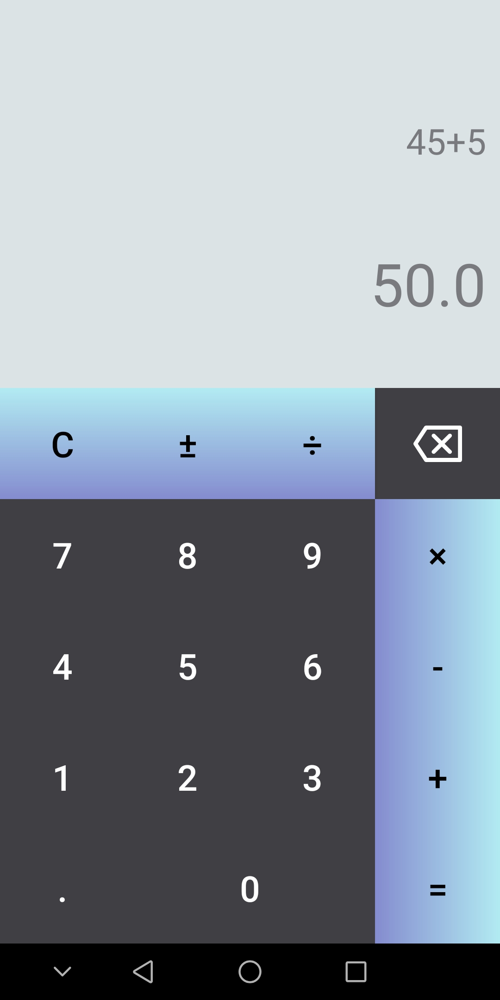
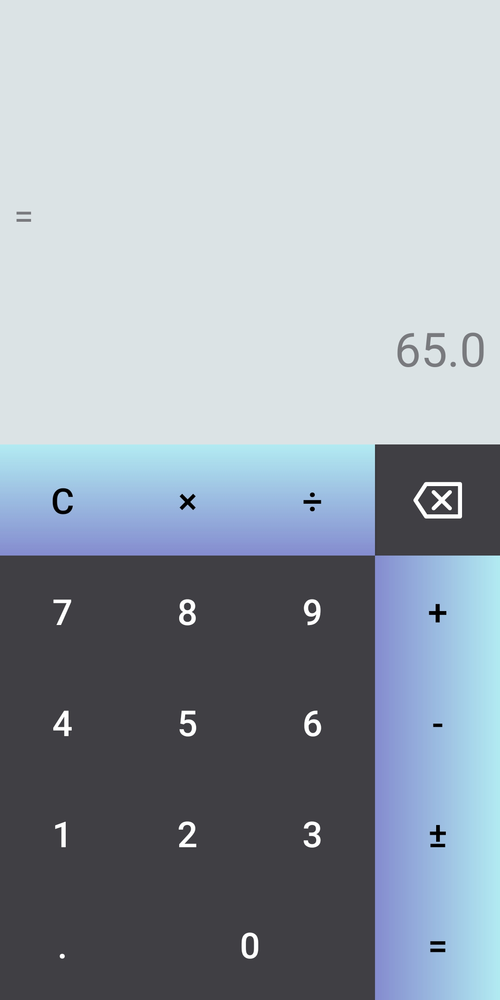

## 𝙎𝙞𝙢𝙥𝙡𝙚-𝘾𝙖𝙡𝙘𝙪𝙡𝙖𝙩𝙤𝙧

//Here are some Screenshots from my Project of Simple Calculator.....

## 𝑼𝑺𝑬𝑹 𝑰𝑵𝑻𝑬𝑹𝑭𝑨𝑪𝑬
   

## 𝑲𝒆𝒚 𝑷𝒐𝒊𝒏𝒕𝒔
* Simple UI and Beautiful Colours.
* This Project just a way of entering into the world of Android Development.
* Many new Android Developers are emerging everyday, they start from a "Hello World" App Program and then they seek to look out for projects to work on.
* Starting with a Calculator App is the best way to enter into the WORLD of ANDROID PROGRAMMING.
* Added a "Splash Screen" at The Initial Activity....
NOTE - I have not used the Google's Directed Method for the Splash Screen. Try to Use that in your Work.
